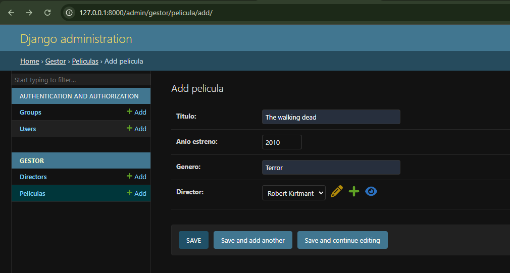
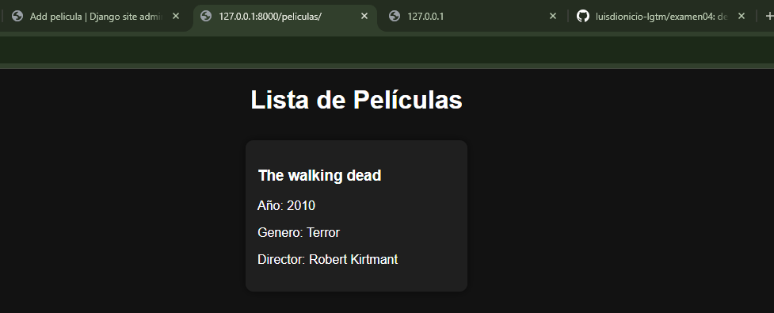
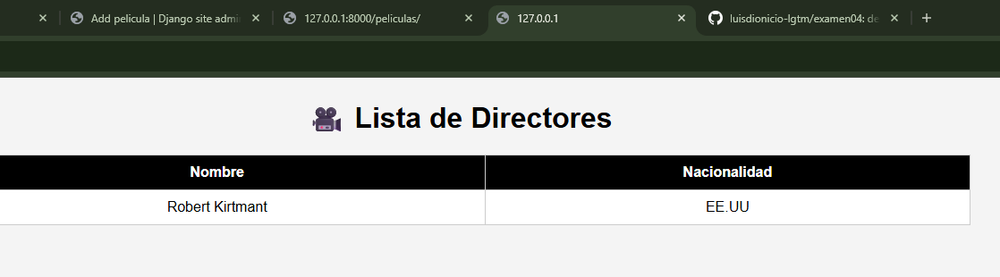

# 🎬 Gestor de Películas - Django

## 📖 Descripción del proyecto
Este proyecto consiste en una aplicación web desarrollada con Django que permite gestionar una colección de películas y sus respectivos directores.

El sistema permite registrar, visualizar y relacionar películas con sus directores, mostrando la información tanto desde el panel administrativo como en el frontend.

Cada película incluye datos como título, año de estreno y género, y está asociada a un director que contiene nombre y nacionalidad.

---

## 🛠️ Tecnologías utilizadas

- Python
- Django
- SQLite (base de datos por defecto)
- HTML - css basico


---

## ⚙️ Pasos para instalación y ejecución

1. Clonar el repositorio:
```bash
git clone https://github.com/luisdionicio-lgtm/examen04
cd peliculasestreno

## 🖼️ Capturas



